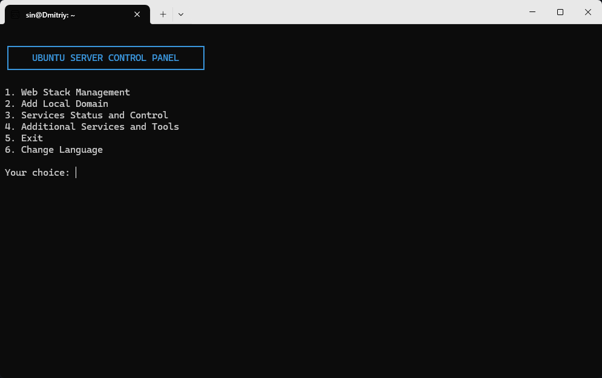
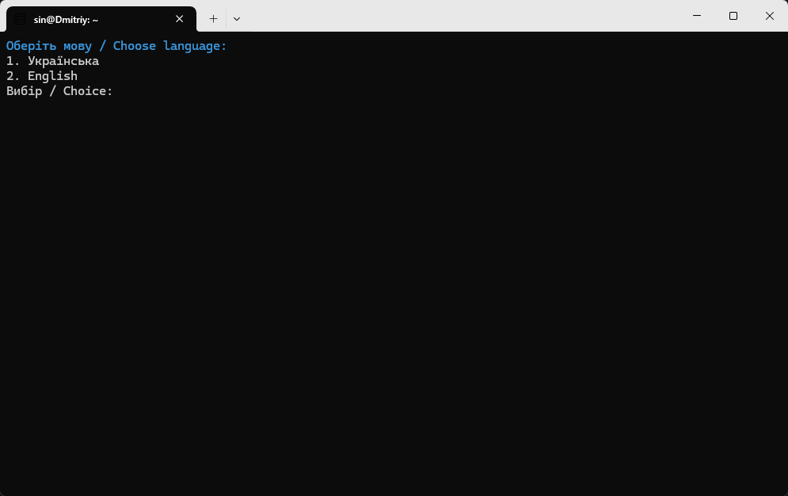
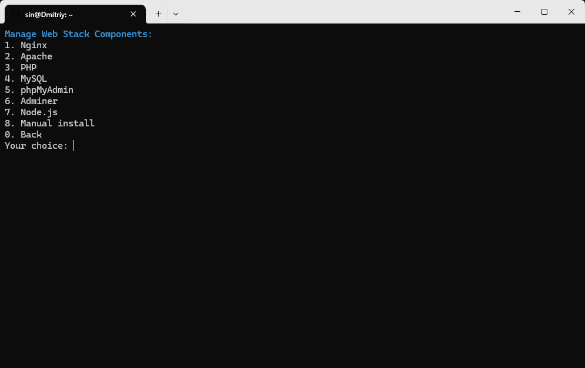
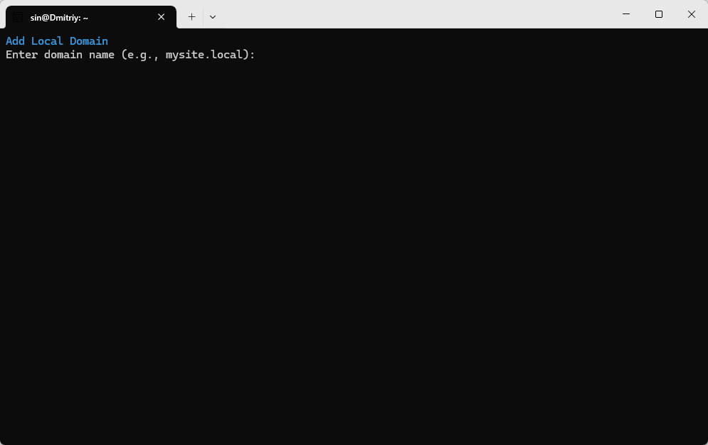
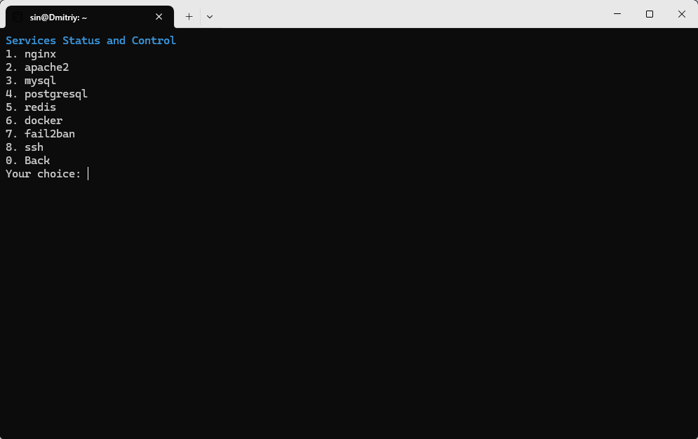
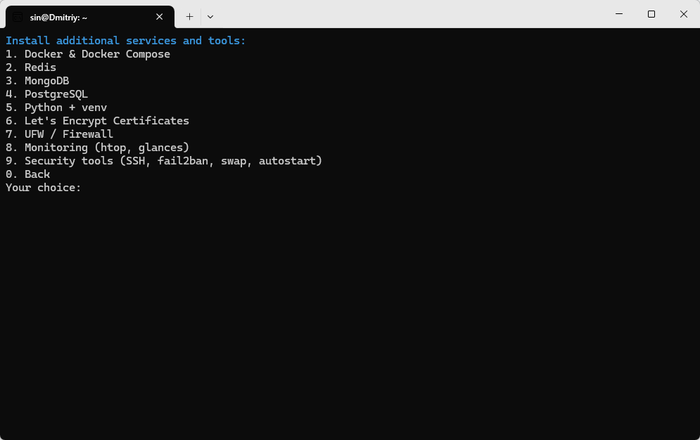

# USOP - Ubuntu Server Operations Panel

<p align="center">
  
  
  <!--  -->
  
</p>

> Консольна система управління сервером Ubuntu
> 
> Ubuntu server management console system

## 📑 Зміст / Contents

- [Про проект / About](#-про-проект--about)
- [Можливості / Features](#-можливості--features)
- [Встановлення / Installation](#-встановлення--installation)
  - [На Ubuntu](#на-ubuntu)
  - [На Windows через WSL](#на-windows-через-wsl)
- [Використання / Usage](#-використання--usage)
- [Автор / Author](#-автор--author)
- [Ліцензія / License](#-ліцензія--license)

## 🚀 Про проект / About

**🇺🇦 Українська:**

USOP (Ubuntu Server Operations Panel) - це консольна утиліта для управління сервером на базі Ubuntu. Вона спрощує налаштування та управління веб-серверами, базами даних, інструментами розробки та системними компонентами через простий інтерфейс командного рядка.

**🇬🇧 English:**

USOP (Ubuntu Server Operations Panel) is a console utility for managing Ubuntu-based servers. It simplifies the setup and management of web servers, databases, development tools, and system components through an easy-to-use command-line interface.

<p align="center">
  
</p>

## ✨ Можливості / Features

**🇺🇦 Українська:**

Система USOP забезпечує встановлення та налаштування:

- **Веб-сервери та мови програмування**:
  - Nginx, Apache
  - PHP
  - Node.js
  - Python (з підтримкою venv)

- **Бази даних**:
  - MySQL
  - PostgreSQL
  - MongoDB
  - Redis

- **Інструменти управління базами даних**:
  - phpMyAdmin
  - Adminer

- **Контейнеризація**:
  - Docker
  - Docker Compose

- **Безпека та мережа**:
  - Let's Encrypt (SSL-сертифікати)
  - UFW (брандмауер)
  - Fail2Ban
  - SSH налаштування

- **Системний моніторинг**:
  - htop
  - glances

- **Системні налаштування**:
  - Керування автозапуском
  - Налаштування swap-файлу
  - Додавання локальних доменів
  - Керування службами

**🇬🇧 English:**

The USOP system provides installation and configuration of:

- **Web Servers and Programming Languages**:
  - Nginx, Apache
  - PHP
  - Node.js
  - Python (with venv support)

- **Databases**:
  - MySQL
  - PostgreSQL
  - MongoDB
  - Redis

- **Database Management Tools**:
  - phpMyAdmin
  - Adminer

- **Containerization**:
  - Docker
  - Docker Compose

- **Security and Network**:
  - Let's Encrypt (SSL certificates)
  - UFW (firewall)
  - Fail2Ban
  - SSH configuration

- **System Monitoring**:
  - htop
  - glances

- **System Settings**:
  - Service autostart management
  - Swap file configuration
  - Local domain additions
  - Service management

## 📥 Встановлення / Installation

### На Ubuntu

**🇺🇦 Українська:**

1. Завантажте скрипт встановлення:

```bash
wget https://raw.githubusercontent.com/vergehen/usop/main/ubuntu_server_setup.sh
```

2. Зробіть його виконуваним:

```bash
chmod +x ubuntu_server_setup.sh
```

3. Запустіть скрипт:

```bash
./ubuntu_server_setup.sh
```

**🇬🇧 English:**

1. Download the installation script:

```bash
wget https://raw.githubusercontent.com/vergehen/usop/main/ubuntu_server_setup.sh
```

2. Make it executable:

```bash
chmod +x ubuntu_server_setup.sh
```

3. Run the script:

```bash
./ubuntu_server_setup.sh
```

### На Windows через WSL

**🇺🇦 Українська:**

1. Активуйте WSL у Windows:
   - Відкрийте PowerShell від імені адміністратора та виконайте:

```powershell
dism.exe /online /enable-feature /featurename:Microsoft-Windows-Subsystem-Linux /all /norestart
dism.exe /online /enable-feature /featurename:VirtualMachinePlatform /all /norestart
```

   - Перезавантажте комп'ютер

2. Встановіть WSL 2 за замовчуванням:
   - Завантажте та встановіть [пакет оновлення ядра Linux для WSL 2](https://wslstorestorage.blob.core.windows.net/wslblob/wsl_update_x64.msi)
   - Відкрийте PowerShell та виконайте:

```powershell
wsl --set-default-version 2
```

3. Встановіть Ubuntu із Microsoft Store:
   - Відкрийте Microsoft Store
   - Знайдіть "Ubuntu" та виберіть версію (наприклад, "Ubuntu 22.04 LTS")
   - Натисніть "Отримати" та дочекайтеся завершення завантаження
   - Натисніть "Запустити"

4. Налаштуйте Ubuntu:
   - При першому запуску створіть користувача та пароль
   - Оновіть систему:

```bash
sudo apt update && sudo apt upgrade -y
```

5. Завантажте та запустіть USOP:

```bash
wget https://raw.githubusercontent.com/vergehen/usop/main/ubuntu_server_setup.sh
chmod +x ubuntu_server_setup.sh
./ubuntu_server_setup.sh
```

**🇬🇧 English:**

1. Enable WSL in Windows:
   - Open PowerShell as Administrator and run:

```powershell
dism.exe /online /enable-feature /featurename:Microsoft-Windows-Subsystem-Linux /all /norestart
dism.exe /online /enable-feature /featurename:VirtualMachinePlatform /all /norestart
```

   - Restart your computer

2. Set WSL 2 as default:
   - Download and install the [Linux kernel update package for WSL 2](https://wslstorestorage.blob.core.windows.net/wslblob/wsl_update_x64.msi)
   - Open PowerShell and run:

```powershell
wsl --set-default-version 2
```

3. Install Ubuntu from Microsoft Store:
   - Open Microsoft Store
   - Search for "Ubuntu" and select a version (e.g., "Ubuntu 22.04 LTS")
   - Click "Get" and wait for the download to complete
   - Click "Launch"

4. Set up Ubuntu:
   - When first launched, create a username and password
   - Update the system:

```bash
sudo apt update && sudo apt upgrade -y
```

5. Download and run USOP:

```bash
wget https://raw.githubusercontent.com/vergehen/usop/main/ubuntu_server_setup.sh
chmod +x ubuntu_server_setup.sh
./ubuntu_server_setup.sh
```

## 🖥 Використання / Usage

<p align="center">
  
</p>

**🇺🇦 Українська:**

Після запуску скрипта, ви побачите консольне меню з наступними опціями:

1. Керування веб-стеком
2. Додати локальний домен
3. Стан та керування службами
4. Додаткові сервіси та інструменти
5. Вихід
6. Змінити мову

Виберіть потрібний пункт, введіть відповідну цифру та слідуйте інструкціям на екрані.

**🇬🇧 English:**

After running the script, you will see a console menu with the following options:

1. Web Stack Management
2. Add Local Domain
3. Services Status and Control
4. Additional Services and Tools
5. Exit
6. Change Language

Choose the desired option by entering the corresponding number and follow the on-screen instructions.

<div align="center">
  <p><b>Керування веб-стеком</b></p>
  
  
  <p><b>Додавання локального домену</b></p>
  
  
  <p><b>Стан та керування службами</b></p>
  
  
  <p><b>Додаткові сервіси та інструменти</b></p>
  
</div>

## 👤 Автор / Author

**🇺🇦 Українська:**

Автор: **Богдан Строй**  
Створено з ❤️ для спрощення управління серверами Ubuntu.

**🇬🇧 English:**

Author: **Bohdan Stroy**  
Created with ❤️ to simplify Ubuntu server management.

## 📄 Ліцензія / License

**🇺🇦 Українська:**

Цей проект ліцензовано за умовами ліцензії MIT. Дивіться файл LICENSE для деталей.

**🇬🇧 English:**

This project is licensed under the MIT License. See the LICENSE file for details.
